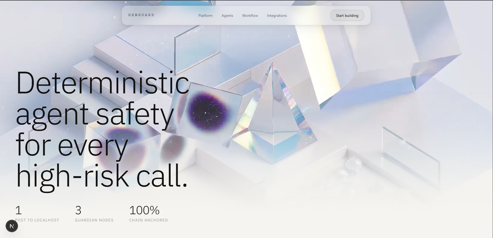

# GenGuard 


>GenGuard is a decentralized governance and safety layer for autonomous AI agents.  
>It combines on-chain policy, multi-guardian consensus over Gensyn AXL, ENS-based identity, and immutable audit on 0G.


## Problem

AI agents are no longer just answering questions, they are taking actions:
posting messages, changing permissions, querying databases, and executing code.
Autonomously, and often without asking for deterministic approval.

The existing safety stack is mostly centralized. One server decides what agents
can and cannot do. That creates:

- One point of failure
- One point of compromise
- One conflict of interest (the same vendor can provide both the agent and its safety layer)

The March 2026 Meta internal agent incident showed the cost of this model:
an agent acted outside role boundaries, triggered an unauthorized workflow,
and exposed sensitive data internally for hours before containment.
No reliable checkpoint stopped it in real time, and post-incident replay was limited.

This is not isolated. Autonomous agents are now an accelerating enterprise risk class,
and incidents rise as agents are granted broader permissions in production systems.

## Solution

GuardMesh is a decentralized firewall for AI agents.
Instead of executing sensitive actions directly, the agent sends one governed request.

1. One integration point for agent developers  
Replace direct execution with one HTTP POST to GuardMesh intent API.

2. Three independent guardians over Gensyn AXL  
Intent is sent peer-to-peer to independent guardian nodes, not through a single central gate.
Each guardian evaluates identity, role scope, action permissions, and content risk.

3. Threshold consensus decides execution  
Majority block -> action is stopped and human escalation is triggered.  
Majority approve -> action executes.  
Threshold mode is configurable (`majority`, `unanimous`, etc.) per organization risk profile.

4. Full immutable evidence on 0G  
Every intent, guardian verdict, and final outcome is written to 0G Storage and anchored to 0G chain contracts (`GuardMeshAudit`), making the trail tamper-proof and replayable.

5. ENS-linked identity and attribution  
Agent IDs can be bound to ENS names (for example `myagentmeta.eth`) through `GuardMeshRegistryENS`,
so policy and audit records remain human-readable and portable.

If this model had been in place during the Meta-style incident, the out-of-scope action
would have been blocked at intent time, with an immutable audit entry instead of hours of uncontrolled exposure.

## Deployed Contracts (0G Galileo Testnet, Chain ID 16602)

From `0g-contracts/deployments/testnet.json` and `0g-contracts/deployments/testnet-ens.json`:

- `GuardMeshRegistry`: `0x0bfB6f131A99D5aaA3071618FFBD5bb3ea87C619`
- `GuardMeshAudit`: `0x522748669646A1a099474cd7f98060968A80E812`
- `GuardMeshRegistryENS`: `0x0925e20438AF659048643Ce747aEe38A7b916E54`

Recommended active registry for web/guardians:

- `NEXT_PUBLIC_REGISTRY_ADDRESS=0x0925e20438AF659048643Ce747aEe38A7b916E54`

## Contract Responsibilities

### GuardMeshRegistry

- Registers policy tuple: `agentId`, `roleScope`, `allowedActions`
- Supports policy lifecycle updates/deactivation/reactivation
- Primary policy source of truth for authorization

### GuardMeshAudit

- Anchors final consensus outcome + metadata
- Stores immutable references for replayable governance audit

### GuardMeshRegistryENS

- Extends registry with ENS identity mapping
- Stores ENS name, namehash node, resolved owner/address metadata
- Supports ENS linkage methods such as `assignENSName` / `registerAgentWithENS`

## End-to-End Architecture

```mermaid
sequenceDiagram
    autonumber
    participant U as User Wallet / Client
    participant UI as Web UI (Next.js)
    participant API as GuardMesh API Layer
    participant REG as RegistryENS (0x0925...E54)
    participant KV as 0G KV Mirror
    participant ENS as Sepolia ENS
    participant G1 as Guardian 1
    participant G2 as Guardian 2
    participant G3 as Guardian 3
    participant ST as 0G Storage
    participant AUD as Audit (0x5227...E812)

    rect rgb(20, 28, 45)
    Note over U,AUD: Registration + Identity Bootstrap
    U->>UI: Submit agentId (example: myagent.eth), role, actions
    UI->>API: register request
    API->>REG: registerAgent(agentId, roleScope, allowedActions)
    REG-->>API: tx confirmed
    API->>KV: kv-sync (mirror on-chain policy)
    KV-->>API: rootHash + txHash
    alt agentId ends with .eth
      API->>ENS: commit + register (Sepolia)
      ENS-->>API: registered/already registered
      API->>REG: assignENSName(agentId, ensName, owner)
      REG-->>API: ENS linked on 0G
    end
    API-->>UI: registration complete
    end

    rect rgb(20, 28, 45)
    Note over U,AUD: Governed Intent Execution
    U->>UI: Request risky action / tool execution
    UI->>API: POST intent + context
    API->>REG: read policy for agentId
    API->>G1: evaluate_intent
    API->>G2: evaluate_intent
    API->>G3: evaluate_intent
    G1-->>API: verdict
    G2-->>API: verdict
    G3-->>API: verdict
    API->>API: compute consensus + action gate
    API->>ST: upload decision bundle
    ST-->>API: merkle root / storage receipt
    API->>AUD: recordDecision(...)
    AUD-->>API: tx receipt
    API-->>UI: approved/blocked + replay refs
    end
```



## 0G Integration (What We Use + Where)

### What 0G is used for

- 0G EVM: on-chain policy and audit contracts
- 0G KV: mirrored policy state for guardian reads
- 0G Storage: decision bundle persistence

### Code locations

- Contracts and deployments  
  - `0g-contracts/contracts/GuardMeshRegistry.sol`
  - `0g-contracts/contracts/GuardMeshRegistry-ENS.sol`
  - `0g-contracts/contracts/GuardMeshAudit.sol`
  - `0g-contracts/deployments/testnet.json`
  - `0g-contracts/deployments/testnet-ens.json`

- Web registration + KV sync path  
  - `Web/app/home/policies/page.tsx`
  - `Web/app/api/guardmesh/kv-sync/route.ts`
  - `Web/app/api/guardmesh/intent/route.ts`

- Guardian KV policy path  
  - `guardmesh-guardian/kv-policy-get.mjs`
  - `guardmesh-guardian/kv-stream-id-normalize.mjs`

## Gensyn Integration (What We Use + Where)

### What Gensyn is used for

- Peer-to-peer guardian communication over AXL
- Distributed verdict collection for consensus
- Removal of centralized safety decision server

### Code locations

- Guardian runtime and AXL flow  
  - `guardmesh-guardian/guardian.js`
  - `guardmesh-guardian/start-guardian-listener.js`
  - `guardmesh-guardian/start-all-listeners.ps1`
  - `axl/` (AXL integration assets and setup)

- Web/API intent dispatch and consensus entry  
  - `Web/app/api/guardmesh/intent/route.ts`
  - `Web/lib/guardmesh.ts`

## ENS Integration (What We Use + Where)

### What ENS is used for

- Human-readable identity for agents and governance attribution
- `.eth` registration/link flow during agent onboarding
- ENS-to-registry linkage for policy identity verification

### Code locations

- ENS registration API + UI trigger  
  - `Web/app/api/guardmesh/ens-register/route.ts`
  - `Web/app/home/policies/page.tsx`

- ENS-aware registry contract  
  - `0g-contracts/contracts/GuardMeshRegistry-ENS.sol`

- Guardian ENS tooling and bootstrapping  
  - `guardmesh-guardian/ens-utils.mjs`
  - `guardmesh-guardian/guardian-ens-boot.mjs`

## Agent Registration Flow (Detailed)

When a user registers an agent in Policy Editor:

1. Web submits policy to `GuardMeshRegistryENS` on 0G.
2. After tx confirmation, Web calls `/api/guardmesh/kv-sync` to mirror policy to 0G KV.
3. If `agentId` is `.eth`, Web calls `/api/guardmesh/ens-register` for ENS registration/link.
4. Guardians consume mirrored policy and identity in intent-time checks.

This ensures policy, storage, and identity are aligned before governed execution.

## Intent Governance Flow (Detailed)

For each high-risk action:

1. Client submits intent + context to `/api/guardmesh/intent`.
2. API loads policy and broadcasts evaluation request to guardian nodes over AXL.
3. Guardians return verdict payloads independently.
4. Consensus engine computes final outcome:
   - `approve` -> action may execute
   - `block` -> action denied
   - `hard_stop_incident` -> deny + escalate to human
5. API writes decision bundle to 0G Storage and records anchor metadata on `GuardMeshAudit`.
6. Response includes final decision and replay references.

## Repository Components

- `Web/`  
  Next.js dashboard + APIs (wallet flow, policies, intent, kv-sync, ens-register)

- `0g-contracts/`  
  Solidity contracts, deploy scripts, and deployment artifacts

- `guardmesh-guardian/`  
  Guardian runtime, ENS utilities, KV policy readers, model adapters

- `axl/`  
  AXL/Gensyn communication layer and related setup

## Environment Notes

Critical web variables:

- `NEXT_PUBLIC_0G_RPC_URL`
- `NEXT_PUBLIC_REGISTRY_ADDRESS`
- `NEXT_PUBLIC_AUDIT_ADDRESS`
- `GUARDMESH_TOOL_SECRET`
- `NEXT_PUBLIC_GUARDMESH_TOOL_SECRET`
- `ENS_REGISTRAR_PRIVATE_KEY`
- `GUARDMESH_KV_STREAM_ID`

Critical guardian variables:

- `GUARDMESH_REGISTRY_ADDRESS`
- `GUARDMESH_POLICY_SOURCE`
- `GUARDMESH_KV_STREAM_ID`
- `GUARDMESH_KV_NODE_URL`
- `AXL_API_URL`
- `GUARDIAN_ID`

## Local Run

```bash
cd Web
pnpm install
pnpm dev
```

Open:

- `http://localhost:3000`
- `http://localhost:3000/home/policies`
- `http://localhost:3000/home/analyze`

## Deployment

Deploy `Web` as the Vercel project root:

- Root Directory: `Web`
- Framework preset: Next.js
- Add all required environment variables in Vercel Project Settings

## Security Notes

- Do not commit production private keys
- Rotate exposed test keys before public demo
- Keep registrar/tool secrets in env manager (not source files)
- Use isolated wallets for ENS registrar and audit recorder roles

## Optional Package/Distribution Note

GenGuard components are modularized for reuse and can be distributed through npm-style packaging for external integration into existing agent systems.

## Repository Layout

```text
GenGuard/
├─ Web/                    # Dashboard + APIs
├─ 0g-contracts/           # Solidity + deployments
├─ guardmesh-guardian/     # Guardian logic + ENS/KV helpers
├─ axl/                    # Guardian mesh transport
└─ integrations/           # Integrations and adapters
```

---

Built on 0G Galileo with Gensyn guardian consensus and ENS-enabled agent identity.
