# GenGuard / GuardMesh

Decentralized governance and safety layer for AI agents using guardian consensus, on-chain policy, ENS identity, and immutable audit on 0G.

## Problem

Autonomous agents in production face four hard trust problems:

- No deterministic policy gate before action execution
- No multi-party consensus for risky operations
- No tamper-proof replay/audit trail for decisions
- No strong, portable identity layer for agents/guardians

## Solution

GuardMesh adds a governance fabric around agent actions:

- **Policy-first execution** via `GuardMeshRegistry` / `GuardMeshRegistryENS`
- **Guardian mesh consensus** over intents before tool execution
- **Immutable audit anchoring** via `GuardMeshAudit` + 0G Storage bundles
- **Identity layer** via ENS registration + ENS linkage on registry
- **KV mirroring** so guardians can read latest policy consistently

## Deployed Contracts (0G Galileo Testnet, Chain ID 16602)

From `0g-contracts/deployments/testnet.json` and `0g-contracts/deployments/testnet-ens.json`:

- **GuardMeshRegistry**: `0x0bfB6f131A99D5aaA3071618FFBD5bb3ea87C619`
- **GuardMeshAudit**: `0x522748669646A1a099474cd7f98060968A80E812`
- **GuardMeshRegistryENS**: `0x0925e20438AF659048643Ce747aEe38A7b916E54`

Recommended active registry in web app:

- `NEXT_PUBLIC_REGISTRY_ADDRESS=0x0925e20438AF659048643Ce747aEe38A7b916E54`

## Contract Roles

- **GuardMeshRegistry**
  - Registers agent policy (`agentId`, `roleScope`, `allowedActions`)
  - Updates/deactivates/reactivates policy state
  - Source of truth for policy authorization

- **GuardMeshAudit**
  - Records final decision root + outcome metadata
  - Immutable, replayable audit receipt for each governed action

- **GuardMeshRegistryENS**
  - Extends registry with ENS identity mapping
  - Stores ENS name, namehash node, resolved address, metadata cache
  - Supports `assignENSName` / `registerAgentWithENS`

## End-to-End Architecture

```mermaid
sequenceDiagram
    autonumber
    participant U as User Wallet / Client
    participant UI as Web UI (Next.js)
    participant API as GuardMesh API Layer
    participant REG as RegistryENS (0x0925...E54)
    participant KV as 0G KV Mirror
    participant ENS as Sepolia ENS
    participant G1 as Guardian 1
    participant G2 as Guardian 2
    participant G3 as Guardian 3
    participant ST as 0G Storage
    participant AUD as Audit (0x5227...E812)

    rect rgb(20, 28, 45)
    Note over U,AUD: Registration + Identity Bootstrap
    U->>UI: Submit agentId (example: myagent.eth), role, actions
    UI->>API: register request
    API->>REG: registerAgent(agentId, roleScope, allowedActions)
    REG-->>API: tx confirmed
    API->>KV: kv-sync (mirror on-chain policy)
    KV-->>API: rootHash + txHash
    alt agentId ends with .eth
      API->>ENS: commit + register (Sepolia)
      ENS-->>API: registered/already registered
      API->>REG: assignENSName(agentId, ensName, owner)
      REG-->>API: ENS linked on 0G
    end
    API-->>UI: registration complete
    end

    rect rgb(20, 28, 45)
    Note over U,AUD: Governed Intent Execution
    U->>UI: Request risky action / tool execution
    UI->>API: POST intent + context
    API->>REG: read policy for agentId
    API->>G1: evaluate_intent
    API->>G2: evaluate_intent
    API->>G3: evaluate_intent
    G1-->>API: verdict
    G2-->>API: verdict
    G3-->>API: verdict
    API->>API: compute consensus + action gate
    API->>ST: upload decision bundle
    ST-->>API: merkle root / storage receipt
    API->>AUD: recordDecision(...)
    AUD-->>API: tx receipt
    API-->>UI: approved/blocked + replay refs
    end
```



## ENS in This Project

ENS is used in two distinct layers:

1. **Real ENS registration on Sepolia**  
   For `*.eth` names, Web API (`/api/guardmesh/ens-register`) performs commit-reveal registration.

2. **Registry-level identity linkage on 0G**  
   After registration, `assignENSName` links agent policy identity to ENS metadata on `GuardMeshRegistryENS`.

Important: linking ENS on 0G registry is not the same as minting/registering a `.eth` name. Both are handled in sequence.

## Core Components

- `Web/`  
  Next.js dashboard + APIs (policy editor, intent API, kv sync, ens registration route)

- `0g-contracts/`  
  Solidity contracts + deployment artifacts for registry, audit, ENS-enabled registry

- `guardmesh-guardian/`  
  Guardian runtime, ENS utilities, KV policy readers, LLM adapters

- `axl/`  
  AXL communication substrate for guardian message exchange

## Environment Notes (Web)

Critical variables:

- `NEXT_PUBLIC_REGISTRY_ADDRESS` (use ENS registry address above)
- `NEXT_PUBLIC_AUDIT_ADDRESS`
- `GUARDMESH_TOOL_SECRET` and `NEXT_PUBLIC_GUARDMESH_TOOL_SECRET`
- `ENS_REGISTRAR_PRIVATE_KEY` (required for real Sepolia ENS registration)
- `GUARDMESH_KV_STREAM_ID` and KV writer keys

## Local Run

```bash
cd Web
pnpm install
pnpm dev
```

Open:

- `http://localhost:3000`
- Policy editor: `http://localhost:3000/home/policies`

## Deployment

Deploy `Web` as Vercel project root.

- Root Directory: `Web`
- Framework: Next.js
- Add required env vars in Vercel Project Settings

## Security Notes

- Never commit production private keys
- Rotate any exposed test keys before public demos
- Keep tool secrets and registrar keys in environment managers (not source files)

## Repository Layout

```text
GenGuard/
├─ Web/                    # Dashboard + APIs
├─ 0g-contracts/           # Solidity + deployments
├─ guardmesh-guardian/     # Guardian logic + ENS/KV helpers
├─ axl/                    # Guardian mesh transport
└─ integrations/           # Integrations and adapters
```

---

Built on 0G Galileo with ENS-enabled identity and guardian consensus governance.
