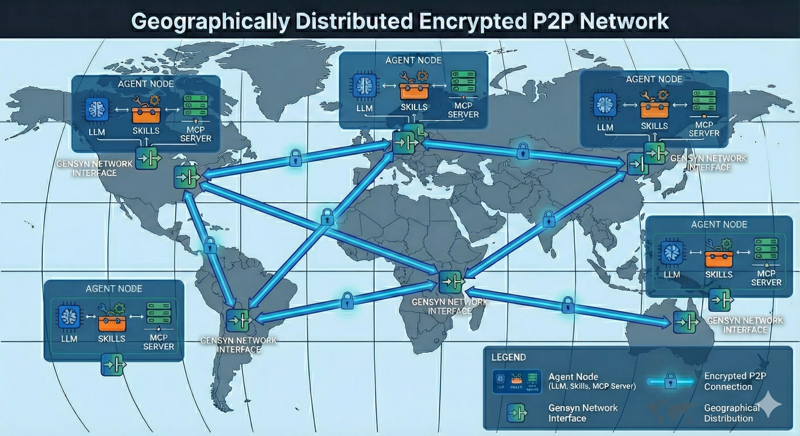

# AXL

Gensyn is building an open, permissionless, P2P network for decentralized agentic and AI/ML applications.  This repository provides a tool to minimize friction when spinning up P2P networks.  It provides a node as an entrypoint into a decentralized P2P network with an api bridge for simple application interface.  The node provides the communication layer for agents and AI applications to exchange data directly with each other, forgoing any centralized services.  

## Overview

This project builds upon the Yggdrasil network stack with gvisor/tcp to provide a standalone network node with a local HTTP API bridge. It allows applications (e.g., serving MoE inference, AI agents, etc.) to send/receive data to/from other nodes without requiring a system-wide TUN interface or root privileges.



**Key features:**
- **No TUN required** — runs entirely in userspace using gVisor's network stack
- **No port forwarding needed** — connects outbound to peers; receives data over the same connection
- **Simple HTTP API** — send/recv binary data, query network topology

## Quick Start
### Requirements
- Go 1.25.5+ installed (the build system pins `GOTOOLCHAIN=go1.25.5` automatically)

```bash
make build
openssl genpkey -algorithm ed25519 -out private.pem # or provide your own key
./node -config node-config.json
```

See [Configuration](docs/configuration.md) for build details, CLI flags, and `node-config.json` options.

## Local Two-Node Runbook (Windows + WSL)

This is a fully local, reproducible setup for running two AXL nodes on one machine and sending a message from Node B to Node A.

### 1) Build the node binary

Run from PowerShell:

```powershell
wsl sh -c "cd /mnt/host/c/Users/Sugan/projects/open/axl && GOTOOLCHAIN=auto go build -o node ./cmd/node"
```

### 2) Generate two keys

From PowerShell in the repo root:

```powershell
cd c:\Users\Sugan\projects\open\axl
python generate-keys.py
```

This creates:
- `private.pem` (Node A)
- `private-2.pem` (Node B)

### 3) Use the working local configs

`node-config.json` (Node A):

```json
{
  "PrivateKeyPath": "private.pem",
  "Peers": [],
  "Listen": ["tls://127.0.0.1:9001"]
}
```

`node-config-2.json` (Node B):

```json
{
  "PrivateKeyPath": "private-2.pem",
  "Peers": ["tls://127.0.0.1:9001"],
  "api_port": 9012,
  "tcp_port": 7000,
  "Listen": []
}
```

Why this works:
- Yggdrasil transport peering is established over `tls://127.0.0.1:9001`.
- Both nodes keep the same internal gVisor TCP port (`tcp_port: 7000`).
- API ports differ so both local HTTP interfaces can run at once (`9002`, `9012`).

### 4) Start both nodes

Terminal A (PowerShell):

```powershell
wsl sh -c "cd /mnt/host/c/Users/Sugan/projects/open/axl && ./node -config node-config.json"
```

Expected log includes:
- `TLS listener started on 127.0.0.1:9001`
- `Listening on 127.0.0.1:9002`

Terminal B (PowerShell):

```powershell
wsl sh -c "cd /mnt/host/c/Users/Sugan/projects/open/axl && ./node -config node-config-2.json"
```

Expected log includes:
- `Configured peer: tls://127.0.0.1:9001`
- `Connected outbound: ...@127.0.0.1:9001`
- `Listening on 127.0.0.1:9012`

### 5) Verify peering

From a third terminal:

```powershell
cd c:\Users\Sugan\projects\open\axl
python test-nodes.py
```

Healthy output should show:
- Node A and Node B public keys and IPv6 addresses
- `Connected peers: 1` for each node
- `Send request completed with status: 200`
- `Received: hello from node B`

### 5b) Three-node hub mesh (GuardMesh)

Use the same hub config (`node-config.json` listens on `tls://127.0.0.1:9001`) and add `node-config-3.json` with `private-3.pem`, `Peers: ["tls://127.0.0.1:9001"]`, `api_port: 9022`. Generate the third key with `python generate-keys.py` (creates `private-3.pem`).

Start **in order**: Terminal A hub (`start-guardian-1.ps1`), then B (`start-guardian-2.ps1`), then C (`start-guardian-3.ps1`). Wait until each log shows the HTTP listener and (for B/C) outbound connected to `:9001`.

**One-shot (WSL):** from PowerShell, `wsl sh /mnt/host/c/Users/<you>/projects/open/axl/start-mesh-wsl.sh` (your distro may use `/mnt/c/...` instead of `/mnt/host/c/...` — use `wsl wslpath -a c:\\path\\to\\open\\axl` to confirm). Stops cleanly with `wsl sh .../stop-mesh-wsl.sh`.

Verify from **WSL** (same loopback as the binaries if you start them via WSL):

```powershell
cd c:\Users\<you>\projects\open\axl
.\run-mesh-test.ps1
```

Or: `wsl sh -c "cd /mnt/c/Users/<you>/projects/open/axl && python3 test-nodes.py"`

Expect: hub **≥2** peers up; B and C each **≥1** up; B→A and C→A send/recv pass. Spoke→spoke is optional and logged as INFO if routing differs.

### 6) Manual send and receive commands

From PowerShell:

```powershell
$NODE_A_KEY = (Invoke-RestMethod http://127.0.0.1:9002/topology).our_public_key
wsl sh -c "curl -s -i -X POST http://127.0.0.1:9012/send -H 'X-Destination-Peer-Id: $NODE_A_KEY' -d 'hello from node B'"
wsl sh -c "curl -s -i http://127.0.0.1:9002/recv"
```

Expected:
- `/send` returns `HTTP/1.1 200 OK` with `X-Sent-Bytes`
- `/recv` returns `HTTP/1.1 200 OK` and body `hello from node B`

### 7) Longer timeout test

```powershell
python test-with-longer-timeout.py
```

Expected:
- `Send succeeded! Status: 200`
- `Recv response: 200`

### 8) Troubleshooting

If `/send` times out and `/recv` returns `204 No Content`:
- Check Node A is listening on `tls://127.0.0.1:9001`.
- Check Node B `Peers` includes `tls://127.0.0.1:9001`.
- Check Node B log contains `Connected outbound`.
- Check each topology response has a non-empty `peers` array.

If `timeout 35 ...` fails in PowerShell:
- That syntax is for `cmd.exe`, not PowerShell.
- Use `python test-with-longer-timeout.py`.
- Or run timeout inside WSL, for example: `wsl sh -c "timeout 35 <command>"`.

### Public Nodes
At least one public node is required for spinning up fresh networks. A public node must meet two criteria:
1. If behind a firewall, configure the host machine to expose a port such that the machine is reachable to network traffic.  
2. configure node-config.json to listen on the port


#### Example Config
For example, if you were to run several machines on a LAN in a hub and spoke configuration, you could set the config of the listening machine to 
```json
{
  "PrivateKeyPath": "private.pem",
  "Peers": [
  ],
  "Listen": ["tls://0.0.0.0:9001"]
}
```
With the private nodes peering to the listening node's IP address
```json
{
  "PrivateKeyPath": "private.pem",
  "Peers": [
    "tls://192.168.0.22:9001"
  ],
  "Listen": []
}
```

## Philosophy

Our intent is to provide a simple, permissionless, and secure communication layer for AI/ML workflows.  This node is agnostic to the application layer and simply provides an interface for applications to build upon.  Enforcing the separation of concerns between the network layer and the application layer allows for greater flexibility and scalability.  We are excited to see what you build!

We encourage anyone to run a public node to help bootstrap the network, or just spin up your own P2P network in isolation.

## Documentation

| Document | Contents |
|----------|----------|
| [Architecture](docs/architecture.md) | System diagram, how it works, wire format, submodules |
| [HTTP API](docs/api.md) | All endpoints: `/topology`, `/send`, `/recv`, `/mcp/`, `/a2a/` |
| [Configuration](docs/configuration.md) | Build/run, CLI flags, `node-config.json` |
| [Integrations](docs/integrations.md) | Python services: MCP router, A2A server, test client |
| [Examples](docs/examples.md) | Remote MCP server, adding A2A |
